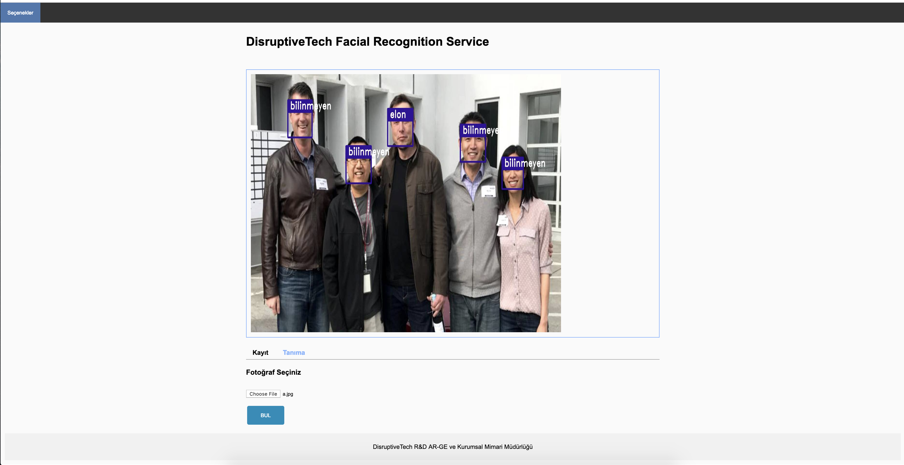
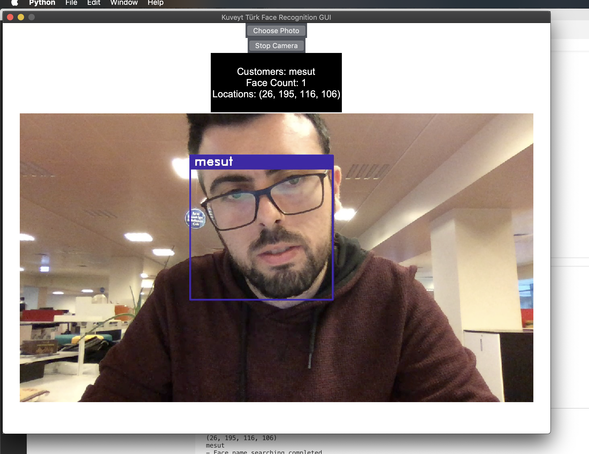

<div>

<center>
<div>
<h1> Deep Learning Based Face Recognition API Service</h1>
<br/>

</div>
</center>
</div>

## What's Deep Learning
Deep learning is a collection of algorithms used in machine learning, used to model high-level abstractions in data through the use of model architectures, which are composed of multiple nonlinear transformations. It is part of a broad family of methods used for machine learning that are based on learning representations of data.

## What's Face Recognition
Facial recognition is a biometric software application capable of uniquely identifying or verifying a person by comparing and analyzing patterns based on the person's facial contours. Facial recognition is mostly used for security purposes, though there is increasing interest in other areas of use. In fact, facial recognition technology has received significant attention as it has potential for a wide range of application related to law enforcement as well as other enterprises.

## Architecture & Tech


### Algorithms

#### K Nearest Neighbors (for face classification)
K nearest neighbors is a simple algorithm that stores all available cases and classifies new cases based on a similarity measure (e.g., distance functions). KNN has been used in statistical estimation and pattern recognition already in the beginning of 1970’s as a non-parametric technique. 

#### HOG (for very fast face detection)
HOG stands for Histograms of Oriented Gradients. HOG is a type of “feature descriptor”. The intent of a feature descriptor is to generalize the object in such a way that the same object (in this case a person) produces as close as possible to the same feature descriptor when viewed under different conditions. This makes the classification task easier.

#### CNN (for classification)
A convolutional neural network (CNN) is a specific type of artificial neural network that uses perceptrons, a machine learning unit algorithm, for supervised learning, to analyze data. CNNs apply to image processing, natural language processing and other kinds of cognitive tasks.


### Dataset
Labeled Faces in the Wild, a database of face photographs designed for studying the problem of unconstrained face recognition. The data set contains more than 13,000 images of faces collected from the web. Each face has been labeled with the name of the person pictured. 1680 of the people pictured have two or more distinct photos in the data set. The only constraint on these faces is that they were detected by the Viola-Jones face detector. More details can be found in the technical report below.

There are now four different sets of LFW images including the original and three different types of "aligned" images. The aligned images include "funneled images" (ICCV 2007), LFW-a, which uses an unpublished method of alignment, and "deep funneled" images (NIPS 2012). Among these, LFW-a and the deep funneled images produce superior results for most face verification algorithms over the original images and over the funneled images (ICCV 2007). 


### GPU Computing with CUDA

Nvidia CUDA is a parallel computing platform and programming model developed by Nvidia for general computing on its own GPUs (graphics processing units). CUDA enables developers to speed up compute-intensive applications by harnessing the power of GPUs for the parallelizable part of the computation.

(You need Nvidia Cuda GPU)

### API's

- [Train New Face](doc/train_face.md) : `POST /api/train`
- [Recognize Photo](doc/recognize_face.md) : `POST /api/recognize`
- [Get Face Labels](doc/faces.md) : `GET /api/faces`
- [Delete Face and Re-Train](doc/clear_face.md) : `POST /api/clear`


## How to run 

Requirements

- Python 3.6
- Dlib (you have to work for windows :) )
- CUDA driver and SDK for GPU Computing

### Run on the web

```bash
git clone https://github.com/kuveytturk/facial-recognition-service.git
cd facial-recognition-service
pip3 install -r requirements.txt
sudo python3 app.py
```

goto http://localhost:5000 for web client


1. Upload the face to be trained and type its name 

<div>


</div>


2. Upload the recognize face

<div>


</div>

### Run on the desktop (with Real Time Camera)

```bash
git clone https://github.com/kuveytturk/facial-recognition-service.git
cd facial-recognition-service
pip3 install -r requirements.txt
cd realtime
sudo python3 main.py
```

<div>


</div>